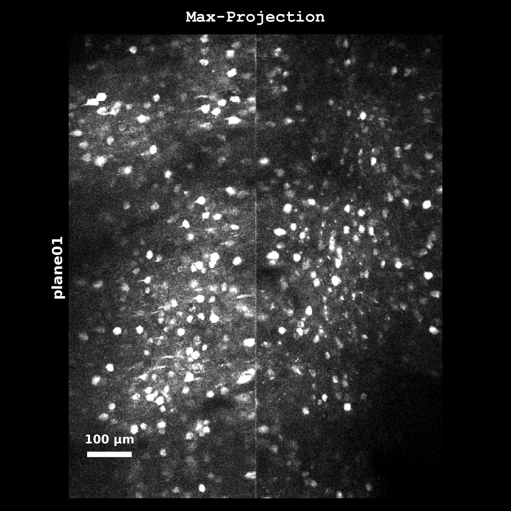
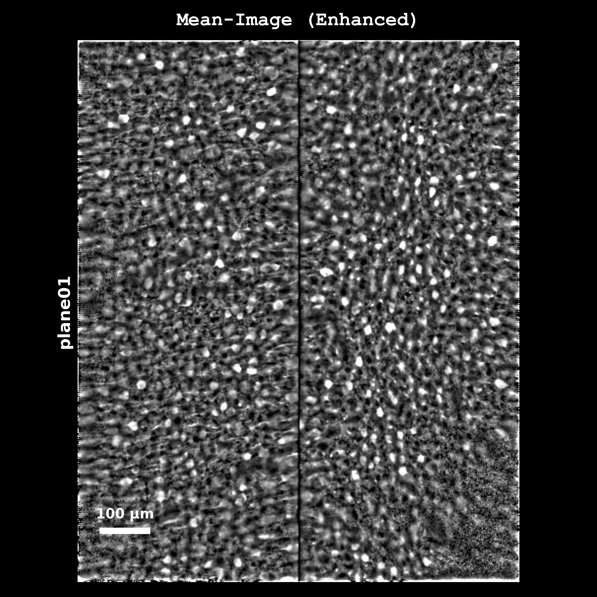
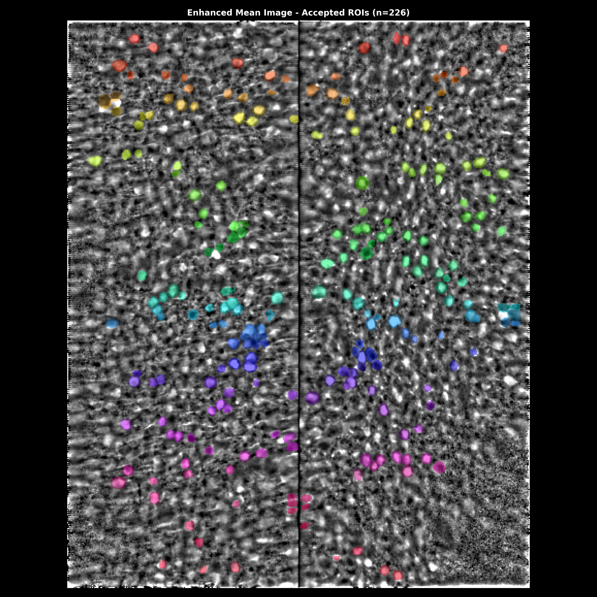

# LBM-Suite2p-Python

> **Status:** Late-beta stage of development

[](https://millerbrainobservatory.github.io/LBM-Suite2p-Python/index.html)

[](https://pypi.org/project/lbm-suite2p-python/)
[](https://doi.org/10.1038/s41592-021-01239-8)

A volumetric 2-photon calcium imaging processing pipeline for Light Beads Microscopy (LBM) datasets, built on Suite2p.

A GUI is available via [mbo_utilities](https://millerbrainobservatory.github.io/mbo_utilities/index.html#gui) (GUI functionality will lag behind this pipeline).

## Installation

See the [installation documentation](https://millerbrainobservatory.github.io/LBM-Suite2p-Python/install.html) for detailed instructions.

### Base Installation (Suite2p only)

```bash
pip install lbm_suite2p_python
```

### With Optional Dependencies

```bash
# With rastermap for activity clustering visualization
pip install "lbm_suite2p_python[rastermap]"

# With cellpose for anatomical cell detection (includes PyTorch)
pip install "lbm_suite2p_python[cellpose]"

# All optional dependencies
pip install "lbm_suite2p_python[all]"
```

### Installation Options

| Extra | Description | Use Case |
|-------|-------------|----------|
| (none) | Base pipeline with Suite2p | Registration, ROI detection, trace extraction |
| `[rastermap]` | Activity clustering | Visualize neural activity patterns sorted by similarity |
| `[cellpose]` | Anatomical detection | GPU-accelerated cell detection using deep learning |
| `[all]` | Everything | Full feature set |

## Quick Start

```python
import lbm_suite2p_python as lsp

ops = {"two_step_registration": 1}
files = [
    r"D://demo//plane05_stitched.zarr",
    r"D://demo//plane06_stitched.zarr",
]

# Process entire volume
output_ops = lsp.run_volume(
    input_files=files,
    save_path=None,     # save next to tiffs
    ops=ops,
    keep_reg=True,      # Keep registered binaries
    force_reg=False,    # Skip if already registered
    force_detect=False  # Skip if stat.npy exists
)
```

**Process a single plane:**
```python
ops_file = lsp.run_plane(
    input_path=files[0],
    save_path=None,
    ops=ops,
    keep_raw=False,  # Delete data_raw.bin after processing
    keep_reg=True    # Keep data.bin (registered binary)
)
```

## Planar Results

Each z-plane produces a set of diagnostic images automatically saved during processing.

<table>
<tr>
<td></td>
<td></td>
<td></td>
</tr>
<tr>
<td align="center"><em>Max Projection</em></td>
<td align="center"><em>Enhanced Mean</em></td>
<td align="center"><em>Segmentation Overlay</em></td>
</tr>
</table>

<p align="center">

<br><em>ROI quality diagnostics: size distribution, SNR, and compactness metrics</em>
</p>

<table>
<tr>
<td></td>
<td></td>
</tr>
<tr>
<td align="center"><em>Raw fluorescence traces</em></td>
<td align="center"><em>ΔF/F traces (top 20 by quality)</em></td>
</tr>
</table>

## Volumetric Results

Volume-level visualizations combine data across all z-planes.

<table>
<tr>
<td></td>
<td></td>
</tr>
<tr>
<td align="center"><em>ROI masks across all planes</em></td>
<td align="center"><em>Orthogonal volume slices</em></td>
</tr>
</table>

<table>
<tr>
<td></td>
<td></td>
</tr>
<tr>
<td align="center"><em>3D ROI map colored by SNR</em></td>
<td align="center"><em>Activity sorted by similarity</em></td>
</tr>
</table>

<p align="center">

<br><em>Volume-wide trace analysis: example traces, SNR per plane, and activity heatmap</em>
</p>

## Documentation

- **[Installation Guide](https://millerbrainobservatory.github.io/LBM-Suite2p-Python/install.html)**
- **[User Guide](https://millerbrainobservatory.github.io/LBM-Suite2p-Python/user_guide.html)** - Complete usage examples
- **[API Reference](https://millerbrainobservatory.github.io/LBM-Suite2p-Python/api.html)**

## Built With

This pipeline integrates several open-source tools:

- **[Suite2p](https://github.com/MouseLand/suite2p)** - Core registration and segmentation
- **[Cellpose](https://github.com/MouseLand/cellpose)** - Anatomical segmentation (optional)
- **[Rastermap](https://github.com/MouseLand/rastermap)** - Activity clustering (optional)
- **[mbo_utilities](https://github.com/MillerBrainObservatory/mbo_utilities)** - ScanImage I/O and metadata
- **[scanreader](https://github.com/atlab/scanreader)** - ScanImage metadata parsing

## Issues & Support

- **Bug reports:** [GitHub Issues](https://github.com/MillerBrainObservatory/LBM-Suite2p-Python/issues)
- **Questions:** See [Suite2p documentation](https://suite2p.readthedocs.io/) for Suite2p-specific questions
- **Known issues:** Widgets may throw "Invalid Rect" errors ([upstream issue](https://github.com/pygfx/wgpu-py/issues/716#issuecomment-2880853089))

## Contributing

Contributions are welcome! This project follows Suite2p's conventions and uses:
- **Ruff** for linting and formatting (line length: 88, numpy docstring style)
- **pytest** for testing
- **Sphinx** for documentation
