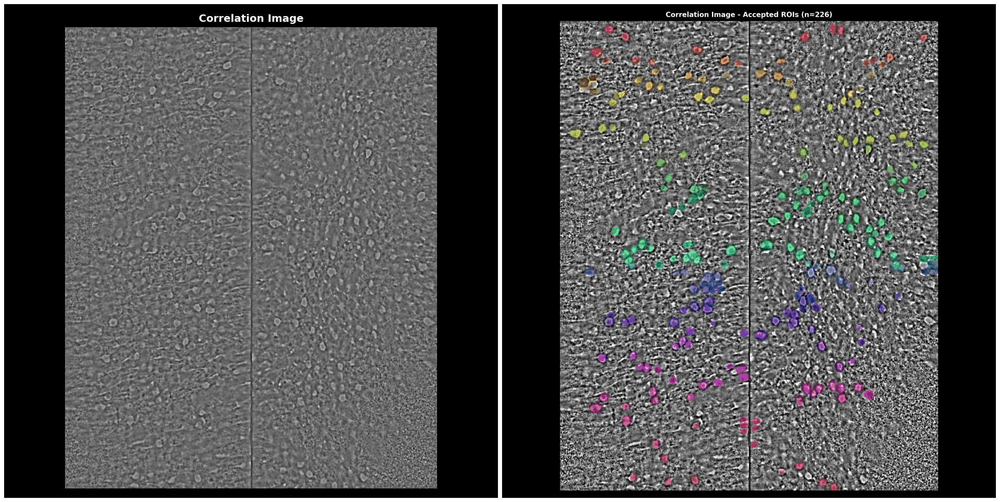
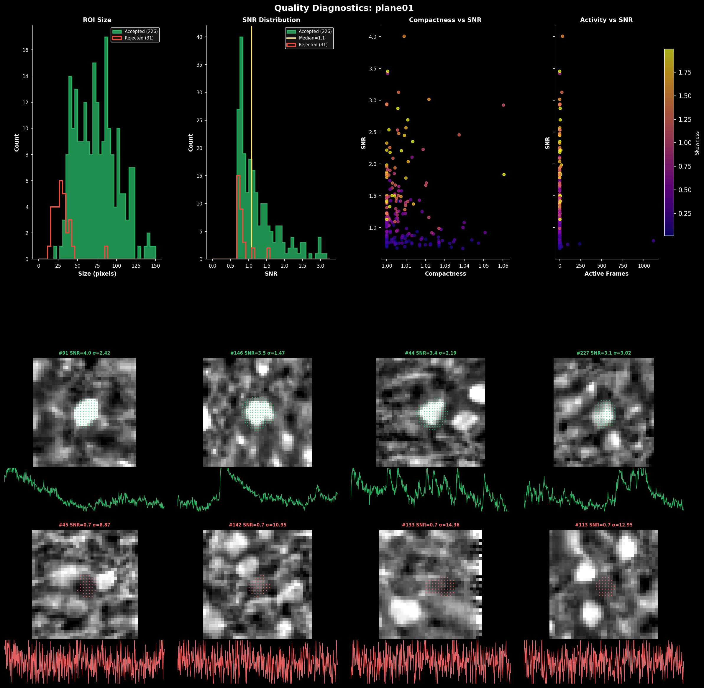
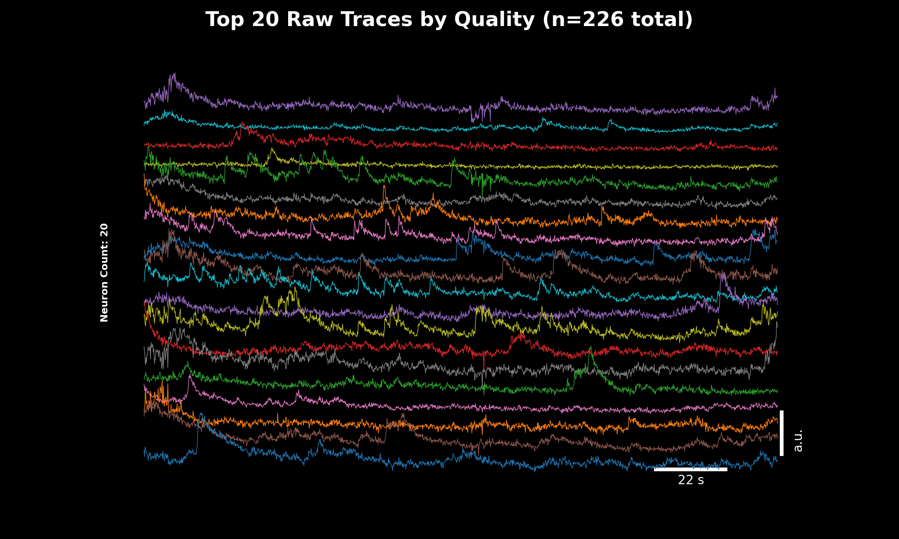
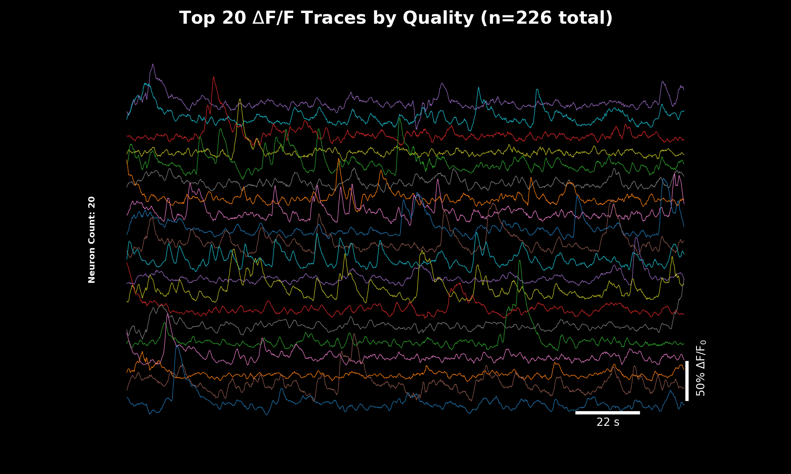
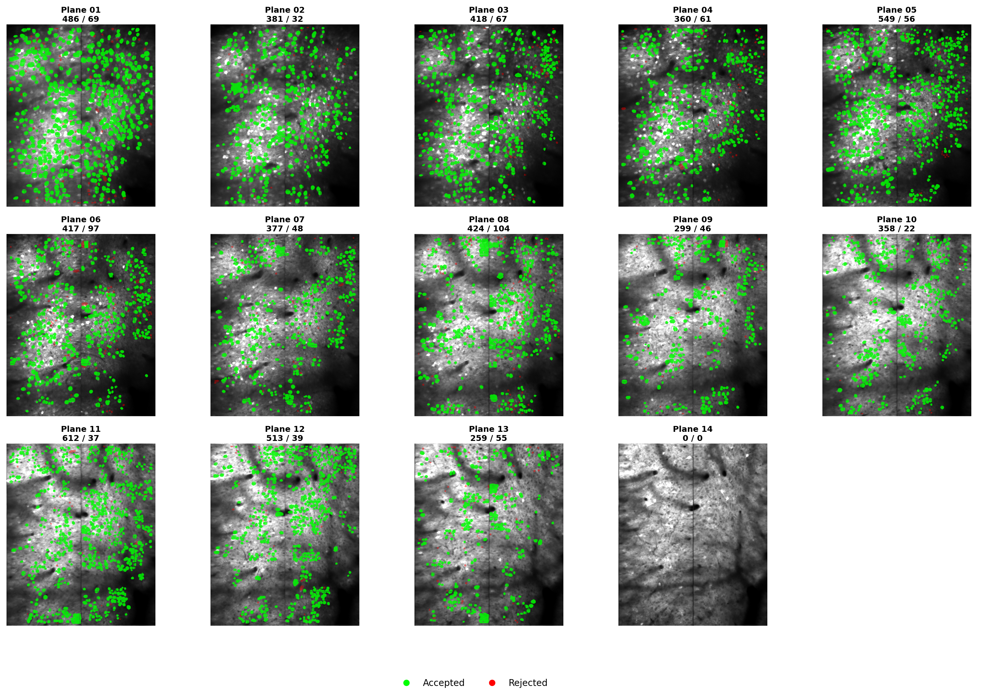
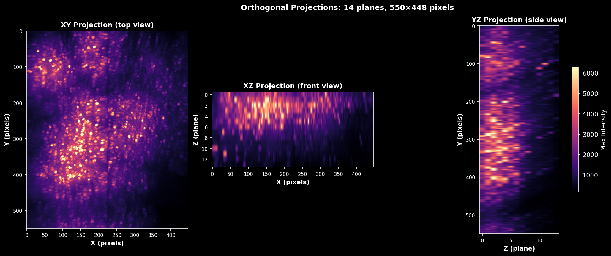
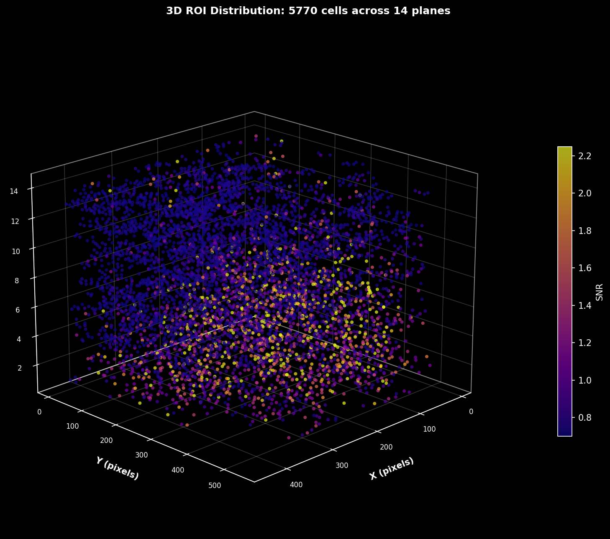
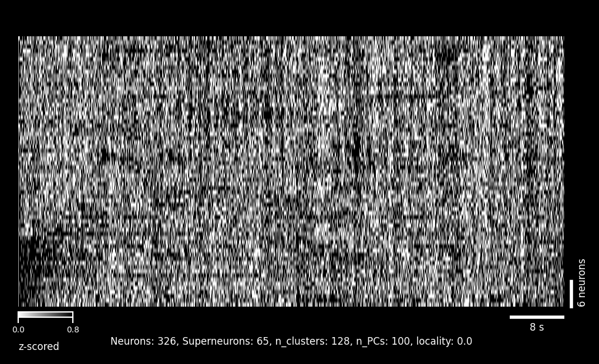
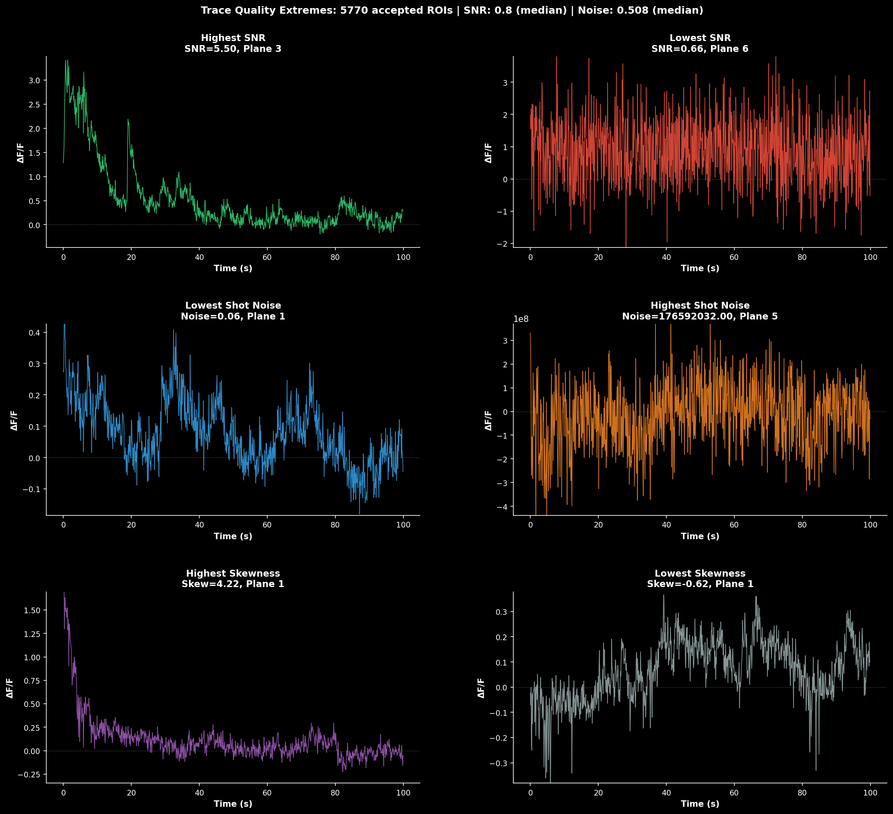

# LBM-Suite2p-Python

> **Status:** Late-beta stage of development

[](https://millerbrainobservatory.github.io/LBM-Suite2p-Python/index.html)

[](https://pypi.org/project/lbm-suite2p-python/)
[](https://doi.org/10.1038/s41592-021-01239-8)

A volumetric 2-photon calcium imaging processing pipeline for Light Beads Microscopy (LBM) datasets, built on Suite2p.

A GUI is available via [mbo_utilities](https://millerbrainobservatory.github.io/mbo_utilities/index.html#gui) (GUI functionality will lag behind this pipeline).

## Installation

See the [installation documentation](https://millerbrainobservatory.github.io/LBM-Suite2p-Python/install.html) for detailed instructions.

### Base Installation

```bash
pip install lbm_suite2p_python
```

### With Optional Dependencies

```bash
# With rastermap for activity clustering visualization
pip install "lbm_suite2p_python[rastermap]"

# With cellpose for anatomical cell detection (includes PyTorch)
pip install "lbm_suite2p_python[cellpose]"

# All optional dependencies
pip install "lbm_suite2p_python[all]"
```

## Quick Start

```python
import lbm_suite2p_python as lsp

results = lsp.pipeline(
    input_data="D:/data/raw",   # path to file, directory, or list of files
    save_path=None,             # default: save next to input
    ops=None,                   # default: use MBO-optimized parameters
    planes=None,                # default: process all planes
    roi=None,                   # default: stitch multi-ROI data
    keep_reg=True,              # default: keep data.bin (registered binary)
    keep_raw=False,             # default: delete data_raw.bin after processing
    force_reg=False,            # default: skip if already registered
    force_detect=False,         # default: skip if stat.npy exists
    dff_window_size=None,       # default: auto-calculate from tau and framerate
    dff_percentile=20,          # default: 20th percentile for baseline
    dff_smooth_window=None,     # default: auto-calculate from tau and framerate
)
```

## Planar Results

Each z-plane produces a set of diagnostic images automatically saved during processing.

<p align="center">

<br><em>Segmentation summary: max projection, enhanced mean, and ROI overlay</em>
</p>

<p align="center">

<br><em>Quality Diagnostics: ROI quality diagnostics: size distribution, SNR, and compactness metrics</em>
</p>

<table>
<tr>
<td></td>
<td></td>
</tr>
<tr>
<td align="center"><em>Raw fluorescence traces</em></td>
<td align="center"><em>ΔF/F traces</em></td>
</tr>
</table>

## Volumetric Results

Volume-level visualizations combine data across all z-planes.

<p align="center">

<br><em>All Planes Masks: ROI masks across all z-planes in the volume</em>
</p>

<p align="center">

<br><em>Orthoslices: Orthogonal volume slices (XY, XZ, YZ planes)</em>
</p>

<p align="center">

<br><em>3D ROI Map: Accepted ROIs colored by SNR</em>
</p>

<p align="center">

<br><em>Rastermap: Neural activity sorted by similarity using dimensionality reduction</em>
</p>

<p align="center">

<br><em>Traces: Highest/Lowest SNR, Shot-Noise, and Skewness (activity) </em>
</p>


## Built With

This pipeline integrates several open-source tools:

- **[Suite2p](https://github.com/MouseLand/suite2p)** - Core registration and segmentation
- **[Cellpose](https://github.com/MouseLand/cellpose)** - Anatomical segmentation (optional)
- **[Rastermap](https://github.com/MouseLand/rastermap)** - Activity clustering (optional)
- **[mbo_utilities](https://github.com/MillerBrainObservatory/mbo_utilities)** - ScanImage I/O and metadata
- **[scanreader](https://github.com/atlab/scanreader)** - ScanImage metadata parsing

## Issues & Support

- **Bug reports:** [GitHub Issues](https://github.com/MillerBrainObservatory/LBM-Suite2p-Python/issues)
- **Questions:** See [Suite2p documentation](https://suite2p.readthedocs.io/) for Suite2p-specific questions
- **Known issues:** Widgets may throw "Invalid Rect" errors ([upstream issue](https://github.com/pygfx/wgpu-py/issues/716#issuecomment-2880853089))

## Contributing

Contributions are welcome! This project follows Suite2p's conventions and uses:
- **Ruff** for linting and formatting (line length: 88, numpy docstring style)
- **pytest** for testing
- **Sphinx** for documentation
