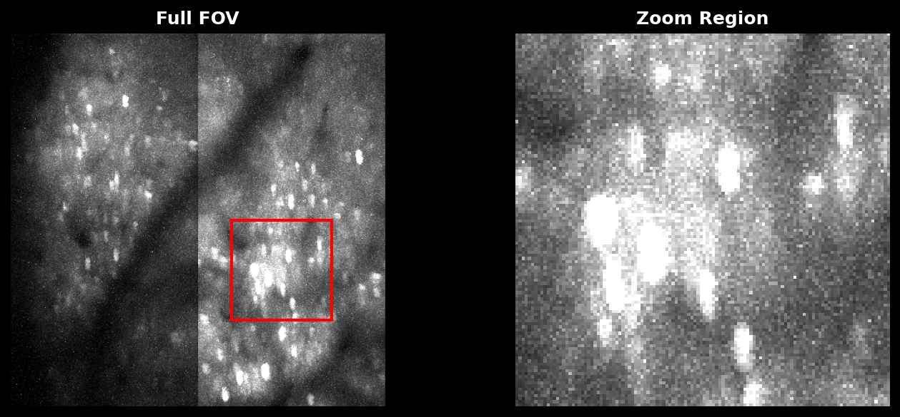
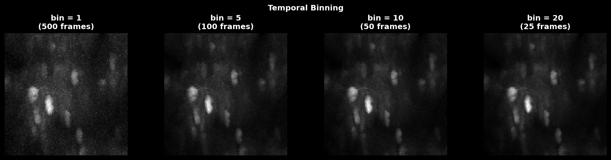
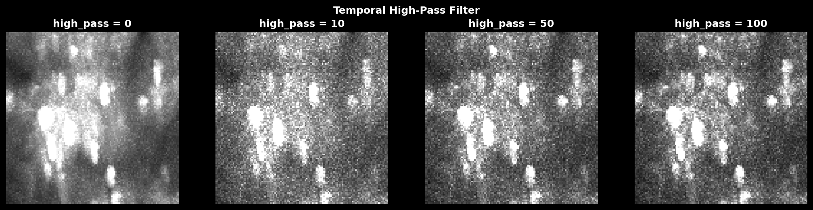
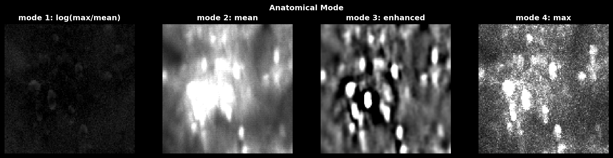
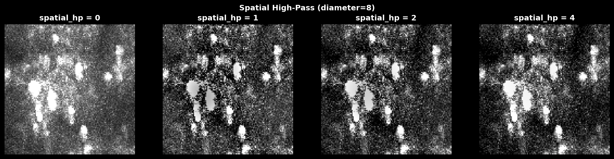
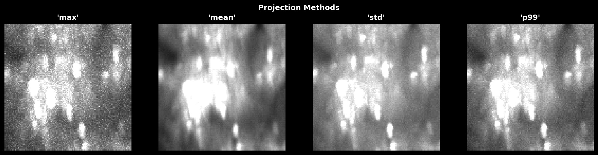
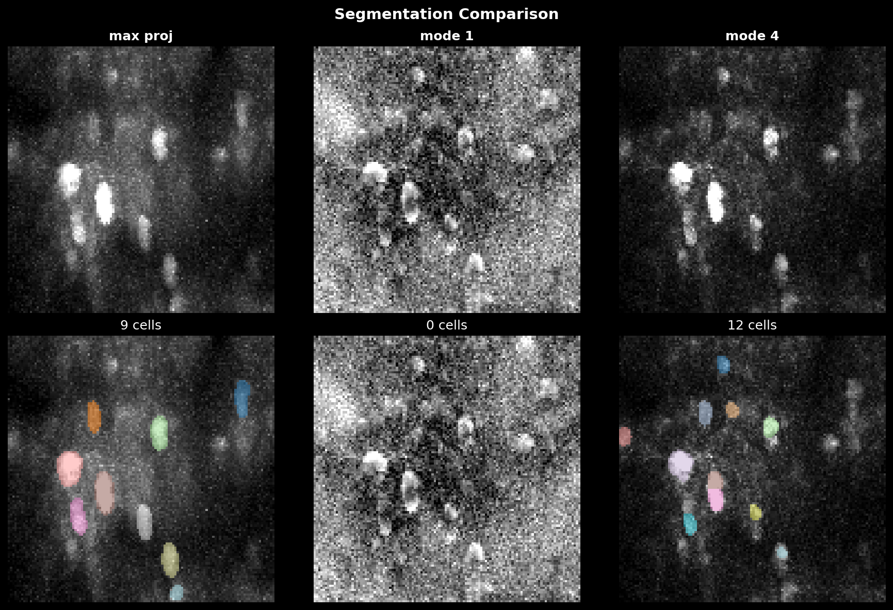

# Suite2p vs Cellpose

Suite2p is a pipeline in which cellpose sits as software responsible for segmentation, just one of the steps involved in calcium imaging.

## Sample Data

The figures below use a 100×120 pixel region from a calcium imaging dataset:



<video width="400" controls autoplay loop muted>
  <source src="_images/cellpose/sample_data.mp4" type="video/mp4">
</video>

Cellpose itself is useful in non-calcium imaging paradigms and is much more actively developed. However, we may wish to incorperate some pre/post processing routines from suite2p to help sharpen our 2D image which is segmented.

Eventually, we would like to consolidate these workflows.

## Overview

| Feature | Suite2p (`anatomical_only`) | `lsp.cellpose()` |
|---------|----------------------------|------------------|
| Preprocessing | Binning, denoising, HP filtering | Simple projection |
| Image options | 4 computed images | Direct projection |
| Parameter control | Suite2p ops dict | Cellpose native |
| Output format | Suite2p (stat.npy) | Both Suite2p + Cellpose GUI |
| Speed | Slower (more steps) | Faster |

## Suite2p Cellpose Pipeline

When you use `lsp.pipeline()` with `anatomical_only > 0`, Suite2p processes your data through several steps before running Cellpose:

1. Temporal Binning → 2. PCA Denoise → 3. HP Filter → 4. Compute Image → 5. Cellpose

### Temporal Binning

Averages consecutive frames to reduce noise and computation:

$$\text{binned}[i] = \frac{1}{b} \sum_{j=0}^{b-1} \text{raw}[i \cdot b + j]$$

```python
# controlled by ops["nbinned"] (default: 1000)
bin_size = max(1, nframes // nbinned, tau * fs)
```

**Scale:** Values 1-20 are typical. Suite2p default targets ~1000 total binned frames.

**Use high values (10-20):** Noisy data, many frames, want faster processing
**Use low values (1-5):** Short recordings, want to preserve transient dynamics



### PCA Denoising (optional)

If `denoise=1` (default), Suite2p applies PCA-based spatial denoising.

```python
# controlled by ops["denoise"] (default: 1)
mov = pca_denoise(mov, block_size=[32, 32], n_comps_frac=0.5)
```

**Effect:** Reduces high-frequency spatial noise while preserving cell structures.

### Temporal High-Pass Filter

Removes slow baseline drift by subtracting a running average:

$$\text{filtered}[t] = \text{raw}[t] - \frac{1}{w} \sum_{i=t-w/2}^{t+w/2} \text{raw}[i]$$

```python
# controlled by ops["high_pass"] (default: 100)
mov = temporal_high_pass_filter(mov, width=high_pass)
```

**Scale:** Values 10-500 frames. Suite2p default is 100.

**Use high values (100-500):** Preserve slower dynamics, less aggressive filtering
**Use low values (10-50):** Remove more baseline, emphasize fast transients
**Use 0:** No filtering (keep raw dynamics)



### Anatomical Mode

Suite2p computes different images for Cellpose based on `anatomical_only`:

| Mode | Formula | Use case |
|------|---------|----------|
| 1 | $\log(\max / \text{mean})$ | Activity contrast (default) |
| 2 | $\text{mean}$ | Stable anatomy |
| 3 | $\text{enhanced mean}$ | High contrast |
| 4 | $\max$ | Direct max projection |

Mode 1 emphasizes active pixels; Mode 4 is closest to direct `lsp.cellpose()`.



### Spatial High-Pass (optional)

Removes large-scale intensity gradients by subtracting a Gaussian-blurred version:

$$\text{filtered} = \text{img} - G_{\sigma}(\text{img})$$

where $\sigma = \text{diameter} \times \text{spatial\_hp\_cp}$.

```python
# controlled by ops["spatial_hp_cp"] (default: 0)
img = normalize99(img)
img -= gaussian_filter(img, diameter * spatial_hp_cp)
```

**Scale:** Values 0-4 (multiplier on cell diameter). Suite2p default is 0 (off).

**Use 1-2:** Mild gradient removal, uneven illumination
**Use 3-4:** Aggressive, may remove cell bodies
**Use 0:** No spatial filtering



### Cellpose Segmentation

Finally, Suite2p runs Cellpose on the processed image:

```python
masks = model.eval(img, channels=[0, 0], diameter=diameter,
                   cellprob_threshold=cellprob_threshold,
                   flow_threshold=flow_threshold)
```

## Direct Cellpose Pipeline (`lsp.cellpose()`)

`lsp.cellpose()` bypasses all Suite2p preprocessing and runs Cellpose directly:

1. Load Data → 2. Projection → 3. Cellpose

### Load Data

Load any format via `mbo.imread()`:

```python
arr = imread(input_path)  # supports TIFF, Zarr, HDF5, etc.
```

### Temporal Projection

Compute a single projection image:

```python
# controlled by projection parameter
proj = np.max(arr, axis=0)  # 'max', 'mean', 'std', or 'percentile'
```

| Projection | Formula | Best for |
|------------|---------|----------|
| `max` | `np.max(arr, axis=0)` | Activity peaks |
| `mean` | `np.mean(arr, axis=0)` | Stable structure |
| `std` | `np.std(arr, axis=0)` | Activity variance |
| `percentile` | `np.percentile(arr, 99, axis=0)` | Robust peaks |



### Run Cellpose

Run Cellpose with full parameter control:

```python
masks, flows, styles = model.eval(
    proj,
    diameter=diameter,
    flow_threshold=flow_threshold,
    cellprob_threshold=cellprob_threshold,
    batch_size=batch_size,
    # ... all Cellpose params available
)
```

## When to Use Each

### Use Suite2p (`anatomical_only`) when:

- You want functional ROI detection with trace extraction
- Your data has significant noise that benefits from denoising
- You want automatic classification and ROI statistics
- You need to integrate with the full Suite2p workflow

### Use `lsp.cellpose()` when:

- You want fast anatomical segmentation only
- You need fine control over Cellpose parameters
- You want to compare different projections quickly
- You need Cellpose GUI-compatible output
- Your data is already preprocessed

## Parameter Comparison

### Suite2p Parameters

```python
lsp.pipeline(
    input_data,
    ops={
        "anatomical_only": 4,      # 1-4: image mode
        "nbinned": 1000,           # temporal binning
        "denoise": 1,              # PCA denoising
        "high_pass": 100,          # temporal HP filter
        "spatial_hp_cp": 0,        # spatial HP filter
        "diameter": 8,             # cell diameter (pixels)
        "cellprob_threshold": 0,   # cell probability
        "flow_threshold": 1.5,     # flow error threshold
    }
)
```

### Direct Cellpose Parameters

```python
lsp.cellpose(
    input_data,
    projection="max",              # 'max', 'mean', 'std', 'percentile'
    model_type="cyto3",            # Cellpose model
    diameter=8,                    # cell diameter (pixels)
    cellprob_threshold=0,          # cell probability
    flow_threshold=0.4,            # flow error threshold
    min_size=15,                   # minimum mask size
    batch_size=8,                  # GPU batch size
    do_3D=False,                   # 3D segmentation
)
```

## Output Comparison

### Suite2p Output

```
plane0/
├── stat.npy          # ROI statistics
├── iscell.npy        # classification
├── F.npy             # fluorescence traces
├── Fneu.npy          # neuropil traces
├── spks.npy          # deconvolved spikes
├── ops.npy           # parameters + images
└── data.bin          # registered movie
```

### `lsp.cellpose()` Output

```
cellpose/
├── masks_plane00.tif       # viewable label image
├── masks_plane00.npy       # numpy masks
├── stat_plane00.npy        # Suite2p-compatible stats
├── iscell_plane00.npy      # all accepted
├── projection_plane00.tif  # image used for segmentation
├── cellpose_seg_plane00.npy  # Cellpose GUI format
├── flows_plane00.npy       # flow fields
└── cellpose_meta.npy       # metadata
```

## Segmentation Comparison

The following figure compares segmentation results across different preprocessing methods:


